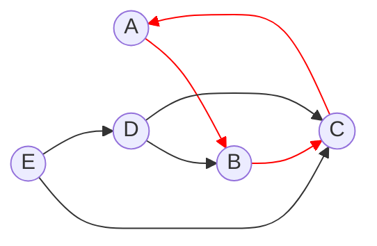

# Algorithms and Data Structures - Topological sorting with DFS

One of the most common algorithms for topological sorting is Depth-First-Search (DFS). This algorithm is particularly useful for directed acyclic graphs (DAGs), where it can efficiently find a linear ordering of vertices such that for every directed edge u -> v, vertex u comes before vertex v in the ordering.

## Characteristics

- Time complexity: O(V + E), where V is the number of vertices and E is the number of edges in the graph. This is because each vertex and edge is processed once during the DFS traversal.
- Space complexity: O(V), where V is the number of vertices. This is due to the storage of the visited vertices and the recursion stack (or an explicit stack if using an iterative approach).

## Demos

### Using Numbered Vertices

[Implementation](./src/01-dfs-using-numbered-vertices.py)

### Using Labelled Vertices

**DAG**:

**Cycle**:

[Implementation](./src/02-dfs-using-labelled-vertices.py)

## References
- [Topological Sorting with Kahn's Algorithm](https://github.com/NelsonBN/algorithms-data-structures-kahn)
- [Other Algorithms & Data Structures](https://github.com/NelsonBN/algorithms-data-structures)
